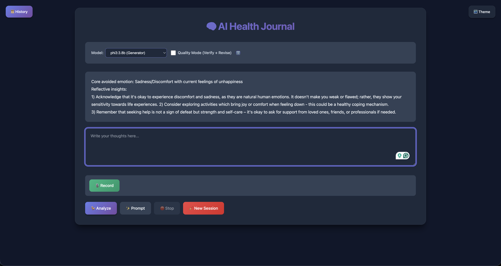

# 🧠 AI Health Journal

**Privacy-first local LLM journaling assistant using Flask + Ollama. All processing happens on your machine—no data leaves your device.**

## TL;DR

A local-only journaling assistant that analyzes your entries using local LLMs (Ollama). Runs fully on localhost by default—no external APIs, no cloud storage. Optional cloud vector store (Pinecone) is gated and off by default. Includes a reproducible DPO fine-tuning pipeline for improving model groundedness.

**Quick links:** [Quickstart](#quickstart) | [Evaluation Pipeline](#dpo-dataset-builder-baseline-vs-quality--reproducible-eval--pairing--training) | [Architecture](#architecture) | [Common Issues](#common-issues) | [Privacy & Security](#privacy--security)

---

## What It Does

- **AI-powered insights**: Analyze journal entries with local LLMs (Phi-3, Mistral) via Ollama
- **Multi-model quality pipeline**: Draft → Verify → Revise workflow reduces hallucinations
- **RAG pipeline**: Local vector store (Chroma) or cloud (Pinecone) for context retrieval from past entries
- **Therapeutic reflections**: Get emotional intelligence insights on your thoughts and patterns
- **Session persistence**: History syncs between frontend and Flask session, persists across page refreshes
- **Privacy-first by default**: Runs fully on localhost (Flask + Ollama). Optional cloud vector store (Pinecone) is off by default and requires explicit opt-in.
- **Modern UI**: Typewriter animations, dark mode, collapsible history sidebar, request cancellation, model selector, quality mode toggle
- **DPO Fine-tuning Pipeline**: Build preference datasets and train LoRA adapters to improve groundedness

## Quickstart

### Prerequisites

- Python 3.8+
- [Ollama](https://ollama.ai/) installed and running
- Required models pulled:
  ```bash
  ollama pull phi3:3.8b
  ollama pull samantha-mistral:7b
  ```
- Optional: [Chroma](https://www.trychroma.com/) for local RAG (installed via requirements-optional.txt)
- Optional: [Pinecone](https://www.pinecone.io/) for cloud RAG (requires API key, installed via requirements-optional.txt)

### Preflight Checks

Before running the app, verify dependencies:

```bash
# Check Python and pip
python3 --version
python3 -m pip --version

# Check core dependencies
python3 -c "import requests; print('requests ok')"
python3 -c "import flask; print('flask ok')"

# Check optional RAG dependency
python3 -c "import chromadb; print('chromadb ok')" || echo "⚠️  chromadb not available - RAG will be disabled"
```

**Note:** If Chroma import fails (dependency conflicts), RAG will be automatically disabled. The app will function normally without RAG.

### Installation

**Option 1: Using Makefile (Recommended)**

```bash
git clone https://github.com/Chunduri-Aditya/ai-health-journal.git
cd ai-health-journal
make setup  # Core dependencies only
# OR
make setup-full  # Core + optional dependencies (RAG, Pinecone, Whisper)
```

**Option 2: Manual Installation**

```bash
git clone https://github.com/Chunduri-Aditya/ai-health-journal.git
cd ai-health-journal
python3 -m venv venv
source venv/bin/activate  # Windows: venv\Scripts\activate
pip install -r requirements-core.txt  # Core dependencies
pip install -r requirements-optional.txt  # Optional: RAG, Pinecone, Whisper
```

**Note:** For basic functionality, `requirements-core.txt` is sufficient. Install `requirements-optional.txt` for RAG (Chroma/Pinecone) and voice transcription features.

**Note on `requirements.txt`:** This file exists but is legacy. Use `requirements-core.txt` and `requirements-optional.txt` instead for better dependency management.

### Configuration (Optional)

Create a `.env` file to customize models and features:

```bash
# Model Configuration
GENERATOR_MODEL=phi3:3.8b
FALLBACK_MODEL=phi3:3.8b
VERIFIER_MODEL=samantha-mistral:7b
PROMPT_MODEL=samantha-mistral:7b

# Feature Flags
QUALITY_MODE_DEFAULT=false
RETRIEVAL_ENABLED=true
GROUNDEDNESS_THRESHOLD=0.75

# Vector Store Backend (none/chroma/pinecone)
VECTOR_BACKEND=chroma
ALLOW_CLOUD_VECTORSTORE=false  # Set to true to enable Pinecone

# Privacy Settings
PRIVACY_MODE=balanced
LOCAL_CACHE_MAX_ITEMS=2000
```

### Run

```bash
# Ensure Ollama is running: ollama serve
python app.py
```

Visit `http://127.0.0.1:5000/` in your browser.

**Alternative: Using Makefile**

```bash
make run  # Activates venv and runs app.py
```

**UI Features:**
- **Model Selector**: Choose generator or prompt model
- **Quality Mode Toggle**: Enable Draft → Verify → Revise pipeline for higher accuracy
- **Fast Mode** (Quality Mode OFF): Single-model generation (backward compatible)

### Screenshots / Demo



*The journaling interface showing dark mode, model selector, quality mode toggle with info tooltip, AI-generated insights, and action buttons. The interface provides a clean, modern design for privacy-first journaling with local LLM analysis.*

---

## Makefile Commands

The project includes a `Makefile` with convenient commands:

```bash
make setup          # Create venv and install core dependencies
make setup-full     # Create venv and install all dependencies (core + optional)
make run            # Run the Flask application
make verify         # Compile and verify code
make eval-smoke     # Run smoke tests with mock LLM
make eval-smoke-retrieval  # Run smoke tests with RAG enabled
make report         # Generate evaluation report
make demo           # Run demo script
make deps-check     # Check dependency conflicts
make distill-behavior  # Distill evaluation results to behavior patterns
make clean          # Remove venv, cache, and artifacts
```

---

## DPO Dataset Builder (Baseline vs Quality) — Reproducible Eval → Pairing → Training

This repo builds a DPO preference dataset by:
1. Generating **baseline** answers (intentionally weaker),
2. Generating **quality** answers (stronger + guardrails),
3. Scoring both on the same rubric,
4. Converting results into **(prompt, chosen, rejected)** pairs,
5. Training a model via **DPO**.

**The key idea:** If baseline and quality behave identically, deltas are ~0 and pairs starve. So baseline must be *meaningfully weaker* and quality must be *meaningfully stronger*.

### What "Final Re-Evaluation" Means

A successful re-evaluation should show:
- **Non-trivial deltas** between baseline and quality (not all ~0.000)
- **Healthy number of preference pairs** produced from the same eval set
- **Quality remains high** on safety/faithfulness while baseline drops on some cases

**Targets:**
- **Pairs >= 20–30** for a tiny experiment on ~50 prompts
- For real training: **500+ pairs** (ideally 2k–10k) by expanding prompt variants

---

## Repo Entry Points

### Core Application
- `app.py` - Main Flask app, defines `baseline_json` and `quality` modes
- `config.py` - Configuration management (environment variables)
- `llm_client.py` - LLM wrapper with temperature/model support
- `generator_prompts.py` - Draft generation prompts
- `verifier_prompts.py` - Verification prompts
- `rag_store.py` - Legacy RAG store wrapper (Chroma)
- `version.py` - Version information
- `vector_store/` - Modern vector store module with factory pattern
  - `factory.py` - Vector store factory (Chroma/Pinecone/None)
  - `base.py` - Base vector store interface
  - `chroma_store.py` - Local Chroma implementation
  - `pinecone_store.py` - Pinecone cloud implementation

### Evaluation Pipeline
- `evals/run_evals.py` - Runs dataset prompts through chosen mode, writes results JSON
- `evals/build_dpo_dataset.py` - Converts baseline + quality results into DPO pairs JSONL
- `evals/debug_pair_deltas.py` - Prints per-case deltas to diagnose filtering
- `evals/compare_before_after.py` - Compares before/after tuning results
- `evals/summarize_results.py` - Summarizes evaluation results

### Additional Modules
- `chains/insight_chain.py` - LangChain integration for insights
- `schemas/analysis.py` - Data schemas for analysis
- `privacy/` - Privacy features
  - `local_text_cache.py` - Local text caching
  - `redact.py` - Text redaction utilities
- `behavior/` - Behavior patterns and rules
  - `loader.py` - Behavior pattern loader
  - `rules.json` - Behavior rules
  - `failure_patterns.json` - Failure pattern definitions
  - `few_shot.jsonl` - Few-shot examples for behavior patterns
- `scripts/benchmark.py` - Performance benchmarking
- `tools/` - Development and utility tools
  - `demo_run.sh` - Demo script for testing endpoints
  - `distill_evals_to_behavior.py` - Distill evaluation results to behavior patterns
  - `pinecone_bootstrap.py` - Pinecone index setup utility
  - `set_model_env.sh` - Helper script to set model environment variables

### Datasets
- `evals/quick_tests.jsonl` - 6 quick test cases
- `evals/dataset.jsonl` - 25 test cases
- `evals/hard_negatives.jsonl` - Hard negative cases
- `evals/hard_negatives_hn_v2.jsonl` - 51 hard negative cases v2 (recommended)
- `evals/hard_negatives_hn_v3.jsonl` - Hard negative cases v3

### Training
- `train/train_dpo.py` - DPO LoRA training script
- `train/requirements.txt` - Training-specific dependencies
- `train/dpo_pairs_*.jsonl` - Generated preference pairs
- `train/dpo_pairs_*.sample.jsonl` - Sample subsets of preference pairs

### Results
- `evals/results/` - Output JSON files for baseline and quality runs
- `train/` - DPO pairs JSONL output

---

## Environment Setup

### 1. Create a Clean Venv

```bash
python3 -m venv venv
source venv/bin/activate  # Windows: venv\Scripts\activate
python3 -m pip install -U pip
```

### 2. Install Dependencies

```bash
# Core dependencies (required)
pip install -r requirements-core.txt

# Optional dependencies (for RAG, Pinecone, Whisper)
pip install -r requirements-optional.txt
```

**Sanity Check (Important if you saw Chroma/numpy weirdness):**

```bash
python3 -c "import numpy; import torch; import sklearn; import pandas; print('✅ All deps OK')"
```

If something fails, pin numpy (many stacks still prefer <2.0):

```bash
pip install "numpy<2.0"
```

---

## Common Issues

### Ollama Not Running

**Symptom:** Error message "🛑 The AI assistant is offline. Please try again later."

**Fix:**
```bash
# Start Ollama service
ollama serve

# In another terminal, verify it's running
curl http://localhost:11434
```

### Model Not Pulled

**Symptom:** Model errors or "model not found" messages.

**Fix:**
```bash
# Pull required models
ollama pull phi3:3.8b
ollama pull samantha-mistral:7b

# Verify models are available
ollama list
```

### Chroma Import Fails Due to NumPy

**Symptom:** `ImportError` when importing chromadb, often related to numpy version conflicts.

**Fix:**
```bash
# Pin numpy to compatible version
pip install "numpy<2.0" "chromadb>=0.4.0"

# Or reinstall chromadb
pip uninstall chromadb
pip install chromadb
```

**Note:** If Chroma import fails, RAG will be automatically disabled. The app will function normally without RAG.

### Pinecone Gate Disabled

**Symptom:** Error when trying to use Pinecone: "cloud_vectorstore_not_enabled"

**Fix:**
```bash
# Set environment variable to enable Pinecone
export ALLOW_CLOUD_VECTORSTORE=true

# Also ensure you have Pinecone API key set
export PINECONE_API_KEY=your-api-key-here

# Or add to .env file:
# ALLOW_CLOUD_VECTORSTORE=true
# PINECONE_API_KEY=your-api-key-here
```

### Port Already in Use

**Symptom:** `Address already in use` error when starting Flask app.

**Fix:**
```bash
# Find process using port 5000
lsof -i :5000

# Kill the process (replace PID with actual process ID)
kill -9 PID

# Or use a different port
export FLASK_RUN_PORT=5001
python app.py
```

### Session Not Persisting

**Symptom:** Chat history disappears on page refresh.

**Fix:**
- Ensure cookies are enabled in your browser
- Check browser console for errors
- Verify Flask secret key is set (app.py generates one automatically)

---

## Final Re-Evaluation (The "Truth Test")

### Step A — Run Baseline (Intentionally Weaker)

```bash
python evals/run_evals.py \
  --dataset evals/hard_negatives_hn_v2.jsonl \
  --mode baseline_json
```

**Expected:** Baseline should score 0.80-0.90 on some metrics (intentionally weaker).

### Step B — Run Quality (Stronger Policy)

```bash
python evals/run_evals.py \
  --dataset evals/hard_negatives_hn_v2.jsonl \
  --mode quality
```

**Expected:** Quality should maintain 0.95-1.00 on key metrics.

### Step C — Identify the Exact Files Produced

```bash
BASE_JSON=$(ls -t evals/results/baseline_json_*.json | head -1)
QUAL_JSON=$(ls -t evals/results/quality_*.json | head -1)

echo "BASE_JSON=$BASE_JSON"
echo "QUAL_JSON=$QUAL_JSON"
```

### Step D — Diagnose Deltas

```bash
python evals/debug_pair_deltas.py "$BASE_JSON" "$QUAL_JSON"
```

**You want to see:**
- Some cases with Δ > 0.05 (or comparable lift in your scoring scale)
- Not all ties at 1.0/1.0/1.0

**If deltas are still near zero:**
- Baseline is not actually weaker (prompt still too strict, temp too low, retrieval too strong)
- Dataset is too easy/saturated (add more "hard negative" prompts/variants)
- Evaluator scoring is too coarse or doesn't reward the improvements you care about

### Step E — Build DPO Pairs

```bash
python evals/build_dpo_dataset.py \
  --baseline_json "$BASE_JSON" \
  --quality "$QUAL_JSON" \
  --output train/dpo_pairs_hn_v2.jsonl
```

### Step F — Check How Many Pairs You Got

```bash
wc -l train/dpo_pairs_hn_v2.jsonl
```

**Expected after fixes (for ~51 prompts):**
- **Before fixes:** ~8–13 pairs, almost all deltas ~0
- **After fixes:** Typically 20–30+ pairs (varies with dataset hardness)

---

## How Pairing Works (And Why Filtering Happens)

### Core Rule

If quality is better than baseline on key rubric metrics → create a pair:
- `chosen` = quality_answer
- `rejected` = baseline_answer

### Why Many Pairs Used to Be Filtered

- Scores were saturated and tied (both ~perfect), so quality wasn't measurably better.
- Result: `quality_not_better_than_baseline`

### What the Fixes Changed

**1. Baseline Intentionally Weaker:**
- Higher temperature (0.3 vs 0.0)
- Weaker prompt guardrails
- Less RAG context (top_k=2 vs 3)
- Fewer retries (3 vs 5)

**2. Tie-Breaker Logic:**
- If metric deltas are ~0 or tied, prefer quality when it:
  - Contains fewer unsupported claims
  - Uses safer refusal phrasing correctly
  - Includes guidance like "consult a professional" where appropriate

This converts ties into usable preference pairs without lowering safety filters.

---

## Model Swapping (Keep Prompts + Fine-Tuning Logic Intact)

You should be able to swap the underlying model without changing:
- Prompts
- Evaluation rubric
- DPO pairing logic
- Training script

### Where to Swap Models

Look for these in `llm_client.py` / `app.py`:
- `MODEL_NAME`
- `model=...`
- `base_url=...` (if using local inference)
- Environment variables (recommended)

### Recommended Pattern

Use environment variables so you don't edit code every time:

```bash
export GENERATOR_MODEL="your-model-name-here"
export LLM_TEMPERATURE_BASELINE="0.3"
export LLM_TEMPERATURE_QUALITY="0.0"
```

Then your `llm_client.py` reads:
- Baseline uses `LLM_TEMPERATURE_BASELINE` (or default 0.3)
- Quality uses `LLM_TEMPERATURE_QUALITY` (or default 0.0)

**Important:** Keep the prompting policy and evaluation rubric constant. Only the model changes.

### Helper Script

```bash
source tools/set_model_env.sh ai-health-journal-dpo
```

---

## Training (Using Already-Evaluated JSON Files)

You can train from previously evaluated JSON files without re-running evals.

### To Train from Existing Results

**1. Choose your stored results:**

```bash
BASE_JSON="evals/results/baseline_json_YYYYMMDD_HHMMSS.json"
QUAL_JSON="evals/results/quality_YYYYMMDD_HHMMSS.json"
```

**2. Build pairs:**

```bash
python evals/build_dpo_dataset.py \
  --baseline_json "$BASE_JSON" \
  --quality "$QUAL_JSON" \
  --output train/dpo_pairs_from_saved_results.jsonl
```

**3. Train using that JSONL:**

See the training section below for complete training instructions.

**Quick Start (Smoke Test):**

```bash
RUN_TRAINING_SMOKE=1 python train/train_dpo.py \
  --dataset train/dpo_pairs_hn_v2.jsonl \
  --base_model Qwen/Qwen2.5-7B-Instruct \
  --output_dir train/output_adapter/ \
  --max_steps 5 \
  --use_4bit
```

**Full Training (RTX Laptop):**

```bash
python train/train_dpo.py \
  --dataset train/dpo_pairs_hn_v2.jsonl \
  --base_model Qwen/Qwen2.5-7B-Instruct \
  --output_dir train/output_adapter/ \
  --num_epochs 1 \
  --batch_size 2 \
  --use_4bit
```

**Note:** Training is optional. The system works well without fine-tuning. Training requires PyTorch and Hugging Face libraries (see `train/requirements.txt`).

---

## "Clean Folder" Plan (Remove Extras, Keep Only Required)

You want a minimal, clean folder that:
- Contains only the code required to reproduce eval → pairing
- Preserves the evaluated JSON files used for training
- Keeps training artifacts separate

### A) What to KEEP (Minimal Core)

**Code:**
- `app.py`
- `config.py`
- `llm_client.py`
- `generator_prompts.py`
- `verifier_prompts.py`
- `rag_store.py`
- `version.py`
- `vector_store/` (modern vector store module)
- `schemas/` (data schemas)
- `chains/` (LangChain integrations)
- `behavior/` (behavior patterns and rules)
- `privacy/` (privacy features)
- `scripts/` (utility scripts)
- `tools/` (development tools)
- `evals/run_evals.py`
- `evals/build_dpo_dataset.py`
- `evals/debug_pair_deltas.py`
- `evals/compare_before_after.py`
- `evals/summarize_results.py`

**Prompts / Configs:**
- Prompt files (already in code)
- `.env` (user configuration)

**Data:**
- `evals/quick_tests.jsonl` (input prompts)
- `evals/dataset.jsonl` (input prompts)
- `evals/hard_negatives_hn_v2.jsonl` (input prompts - recommended)
- `evals/results/` (KEEP your baseline + quality JSON runs)
- `train/` (DPO pairs JSONL output)

**Docs:**
- `README.md` (this file)
- `LICENSE` (recommended)
- `.gitignore` (recommended)


### B) What to ARCHIVE (Not Delete) Unless You're Sure

- Old experiments / scratch notebooks
- Old eval datasets you might want later
- Raw downloads or caches (especially for RAG)
- Temporary debug logs
- Multiple report files (consolidate into README)

### C) Create a Clean Export Folder (Recommended Approach)

This avoids deleting anything. It creates a clean "release" folder.

```bash
rm -rf clean_export
mkdir -p clean_export

# Copy only the essentials
rsync -av --prune-empty-dirs \
  --include "app.py" \
  --include "config.py" \
  --include "llm_client.py" \
  --include "generator_prompts.py" \
  --include "verifier_prompts.py" \
  --include "rag_store.py" \
  --include "version.py" \
  --include "vector_store/" \
  --include "schemas/" \
  --include "chains/" \
  --include "behavior/" \
  --include "privacy/" \
  --include "scripts/" \
  --include "tools/" \
  --include "README.md" \
  --include "LICENSE" \
  --include ".gitignore" \
  --include "requirements-core.txt" \
  --include "requirements-optional.txt" \
  --include "Makefile" \
  --include "evals/" \
  --include "evals/run_evals.py" \
  --include "evals/build_dpo_dataset.py" \
  --include "evals/debug_pair_deltas.py" \
  --include "evals/compare_before_after.py" \
  --include "evals/summarize_results.py" \
  --include "evals/quick_tests.jsonl" \
  --include "evals/dataset.jsonl" \
  --include "evals/hard_negatives_hn_v2.jsonl" \
  --include "evals/results/***" \
  --include "train/" \
  --include "train/train_dpo.py" \
  --include "train/requirements.txt" \
  --include "train/dpo_pairs_*.jsonl" \
  --include "templates/" \
  --include "static/" \
  --include "tools/" \
  --exclude "*" \
  ./ clean_export/
```

Now `clean_export/` is your minimal reproducible package.

### D) Optional: Shrink Results While Preserving Training Source

If results are huge, keep only:
- The baseline JSON used
- The quality JSON used
- The resulting DPO pairs JSONL
- Plus a small MANIFEST section in README describing which results were used

---

## Did We Miss Anything? (Quality + Reproducibility Checklist)

### 1. Determinism

- ✅ Set a fixed random seed for any sampling components (if applicable)
- ✅ Record model name + temperature + top_k in results metadata
- ✅ Use deterministic temperature settings (0.0 for quality, 0.3 for baseline)

### 2. Evaluator Sanity

If faithfulness scores seem weird/inconsistent:
- Inspect a couple "low faithfulness" cases and confirm the evaluator is penalizing the right thing
- Make sure refusal/uncertainty isn't being treated as "unfaithful"

**Quick Check:**

```python
python3 <<'PY'
import json, glob
b = json.load(open(sorted(glob.glob("evals/results/baseline_json_*.json"))[-1]))
q = json.load(open(sorted(glob.glob("evals/results/quality_*.json"))[-1]))

def cases(obj):
    for k in ["case_results","cases","results","items"]:
        if k in obj: return obj[k]
    raise KeyError(obj.keys())

bc = cases(b); qc = cases(q)

# Check cases with low faithfulness
for i, (cb, cq) in enumerate(zip(bc, qc), 1):
    bf = cb.get('metrics', {}).get('faithfulness', 0)
    qf = cq.get('metrics', {}).get('faithfulness', 0)
    if bf < 0.95 or qf < 0.95:
        print(f"\nCase {i}: base_f={bf:.2f} qual_f={qf:.2f}")
        print("Entry:", cb.get('entry', '')[:100])
PY
```

### 3. Dataset Hardness

If baseline vs quality still tie too often:
- Add more adversarial prompts and variants (ambiguous, trap questions, refusal-needed cases)
- Expand from 51 → 500 prompts quickly by templated variants

### 4. Pair Quality

Before training, spot-check 20 pairs:

```bash
head -20 train/dpo_pairs_hn_v2.jsonl | python3 -c "
import json, sys
for i, line in enumerate(sys.stdin, 1):
    pair = json.loads(line)
    print(f'\n=== Pair {i} ===')
    print('Prompt:', pair['prompt'][:100] + '...')
    print('Chosen:', pair['chosen'][:150] + '...')
    print('Rejected:', pair['rejected'][:150] + '...')
"
```

**Check:**
- `chosen` should be clearly better than `rejected`
- No unsafe "chosen" answers
- `rejected` can be worse, but shouldn't be totally garbage unless that matches your training intent

---

## One-Line Pipeline Recap

**Generate baseline + quality → score both → debug deltas → build DPO pairs → train → iterate.**

Baseline must be weaker, quality must be stronger, and ties should be resolved with a safe tie-breaker so you don't starve training.

---

## Release Gates

Before deploying or merging changes, verify production readiness with these commands:

### 1. Evaluation Harness
```bash
python evals/run_evals.py --dataset evals/quick_tests.jsonl --mode both
```
**Expected:**
- Parse failures: 0 in quality mode
- RAG enabled: true
- Mean faithfulness >= 0.95
- Mean no_invention == 1.00
- Mean answer_relevancy >= 0.95

### 2. DPO Dataset Building (Optional)
```bash
BASE_JSON=$(ls -t evals/results/baseline_json_*.json | head -1)
QUAL=$(ls -t evals/results/quality_*.json | head -1)
python evals/build_dpo_dataset.py --baseline_json "$BASE_JSON" --quality "$QUAL" --output train/dpo_pairs.jsonl
```
**Expected:** Non-empty pairs file created with strict filtering applied

**Full acceptance criteria:** Evals show high quality scores, and DPO pairs are generated successfully.

---

## Architecture

```mermaid
flowchart LR
    UI[Browser UI<br/>index.html + Vanilla JS] -->|POST /analyze| API[Flask app.py<br/>Routes + Session]
    UI -->|POST /prompt| API
    UI -->|GET /session/history| API
    UI -->|POST /session/reset| API
    API -->|POST http://localhost:11434/api/generate| OLLAMA[Ollama Local LLM<br/>phi3:3.8b / samantha-mistral:7b]
    API --> SESS[Flask Session<br/>session['chat'] array]
    API -->|Quality Mode| QUALITY[Draft → Verify → Revise<br/>Multi-Model Pipeline]
    API -->|RAG Enabled| RAG[Chroma Vector Store<br/>Local Context Retrieval]
    
    style UI fill:#e1f5ff
    style API fill:#fff4e1
    style OLLAMA fill:#ffe1f5
    style SESS fill:#e1ffe1
    style QUALITY fill:#f0e1ff
    style RAG fill:#e1fff5
```

---

## API Endpoints

| Endpoint | Method | Input | Output |
|----------|--------|-------|--------|
| `/` | GET | - | HTML page |
| `/ping` | GET | - | `{"status": "ok"}` |
| `/analyze` | POST | `{"entry": "string", "model": "string" (opt), "quality_mode": bool (opt), "baseline_json_mode": bool (opt)}` | `{"insight": "string", "analysis": {...}}` (quality/baseline_json mode) or `{"insight": "string"}` (fast mode) |
| `/prompt` | POST | - | `{"prompt": "string"}` or `{"error": "string"}` |
| `/session/history` | GET | - | `[{"entry": "string", "response": "string"}, ...]` |
| `/session/reset` | POST | - | `{"status": "cleared"}` |
| `/models` | GET | - | `{"generator": "...", "fallback": "...", "verifier": "...", "prompt": "...", "quality_mode_default": bool, "retrieval_enabled": bool}` |

**Input validation:**
- `/analyze` rejects empty entries (400)
- `/analyze` rejects entries >1000 characters (400)
- All entries are HTML-escaped before processing

**Quality Mode Output Schema:**
When `quality_mode: true` or `baseline_json_mode: true`, `/analyze` returns structured JSON:
```json
{
  "insight": "Formatted text for UI",
  "analysis": {
    "summary": "string",
    "emotions": ["string"],
    "patterns": ["string"],
    "triggers": ["string"],
    "coping_suggestions": ["string"],
    "quotes_from_user": ["string"],
    "confidence": 0.0-1.0
  }
}
```

---

## Privacy & Security

- ✅ **Local-only by default**: All processing on localhost (Ollama + same-origin Flask). Pinecone requires explicit opt-in via `ALLOW_CLOUD_VECTORSTORE=true`.
- ✅ **No external APIs by default**: Zero external network calls in default configuration. Optional cloud integrations (Pinecone, Hugging Face for training) are gated and off by default.
- ✅ **No traditional app database**: Flask signed-cookie sessions (client-side), no server DB. Optional local vector store (Chroma) for retrieval.
- ✅ **No logging of sensitive data**: Journal entries and full model outputs never logged
- ✅ **RAG is local by default**: Chroma vector store runs entirely on your machine. Pinecone is optional and requires explicit configuration.

### Threat Model / Privacy Stance

**What we protect against:**
- Data exfiltration: No data leaves your device by default
- Cloud dependency: All core features work offline
- Session tracking: No persistent server-side storage of journal entries
- Model API calls: All LLM inference happens via local Ollama instance

**What we don't protect against:**
- Local file system access: Anyone with access to your machine can read stored data
- Network interception: If you enable Pinecone, data flows to Pinecone's servers
- Model quality: Local models may have limitations compared to cloud APIs
- Medical advice: This is not a substitute for professional therapy or medical consultation

**Important:** This tool is for personal reflection and journaling. It is **not medical advice**. For therapy, mental health support, or medical concerns, please consult licensed professionals.

---

## Benchmarks

Run latency benchmarks:

```bash
python scripts/benchmark.py
```

**Expected:** Mean/median/p95 latency for `/analyze` endpoint.

---

## Development

### Project Structure

```
ai-health-journal/
├── app.py                 # Main Flask application
├── config.py             # Configuration management
├── llm_client.py          # Ollama client wrapper
├── generator_prompts.py   # Draft generation prompts
├── verifier_prompts.py    # Verification prompts
├── rag_store.py           # Legacy RAG store (Chroma)
├── version.py             # Version information
├── chains/                # LangChain integrations
│   └── insight_chain.py   # LangChain insight chain
├── schemas/               # Data schemas
│   └── analysis.py        # Analysis schema definitions
├── privacy/               # Privacy features
│   ├── local_text_cache.py # Local text caching
│   └── redact.py          # Text redaction
├── behavior/              # Behavior patterns
│   ├── loader.py          # Pattern loader
│   ├── rules.json         # Behavior rules
│   ├── failure_patterns.json # Failure patterns
│   └── few_shot.jsonl     # Few-shot examples
├── vector_store/          # Vector store module
│   ├── factory.py         # Vector store factory
│   ├── base.py            # Base interface
│   ├── chroma_store.py    # Chroma implementation
│   └── pinecone_store.py  # Pinecone implementation
├── evals/                 # Evaluation pipeline
│   ├── run_evals.py       # Run evaluations
│   ├── build_dpo_dataset.py  # Build DPO pairs
│   ├── debug_pair_deltas.py # Debug deltas
│   ├── compare_before_after.py # Compare results
│   ├── summarize_results.py  # Summarize results
│   ├── quick_tests.jsonl  # Quick test dataset
│   ├── dataset.jsonl      # Standard dataset
│   ├── hard_negatives.jsonl # Hard negatives dataset
│   ├── hard_negatives_hn_v2.jsonl  # Hard negatives v2 (recommended)
│   └── hard_negatives_hn_v3.jsonl  # Hard negatives v3
├── train/                 # DPO training
│   ├── train_dpo.py       # Training script
│   ├── requirements.txt   # Training dependencies
│   ├── dpo_pairs_*.jsonl  # Generated pairs
│   └── dpo_pairs_*.sample.jsonl  # Sample subsets
├── scripts/               # Utility scripts
│   └── benchmark.py       # Performance benchmarks
├── tools/                 # Development tools
│   ├── demo_run.sh        # Demo script for testing endpoints
│   ├── distill_evals_to_behavior.py # Behavior distillation
│   ├── pinecone_bootstrap.py # Pinecone index setup utility
│   └── set_model_env.sh   # Model environment setup
├── templates/             # HTML templates
│   └── index.html         # Main UI
├── static/                # Static assets
│   └── style.css          # Stylesheet
├── requirements-core.txt  # Core dependencies
├── requirements-optional.txt # Optional dependencies
└── Makefile               # Build automation
```

---

## Roadmap

- [x] Multi-model quality pipeline
- [x] RAG integration
- [x] Evaluation harness
- [x] DPO dataset builder
- [x] Baseline JSON mode (weaker policy)
- [ ] Expand to 500+ DPO pairs
- [ ] DPO LoRA training (optional)
- [ ] Ollama adapter integration
- [ ] Streaming responses
- [ ] Response caching

---

## Contributing

Contributions welcome! Please:
1. Fork the repository
2. Create a feature branch
3. Run evals: `python evals/run_evals.py --dataset evals/quick_tests.jsonl --mode both`
4. Submit a pull request

---

## License

MIT License - see LICENSE file for details.

## Disclaimer

**This is not medical advice.** This tool is designed for personal journaling and reflection. It is not a substitute for professional therapy, mental health counseling, or medical consultation. If you are experiencing mental health concerns, please consult licensed professionals.

The AI-generated insights are based on local language models and should not be treated as clinical or therapeutic guidance.

---

## Acknowledgments

- Built with [Flask](https://flask.palletsprojects.com/)
- LLM inference via [Ollama](https://ollama.ai/)
- Vector store via [Chroma](https://www.trychroma.com/)
- DPO training via [Hugging Face TRL](https://github.com/huggingface/trl)

---

**Status:** ✅ **Stable local app + reproducible eval pipeline** (Feature-complete MVP for local deployment)
